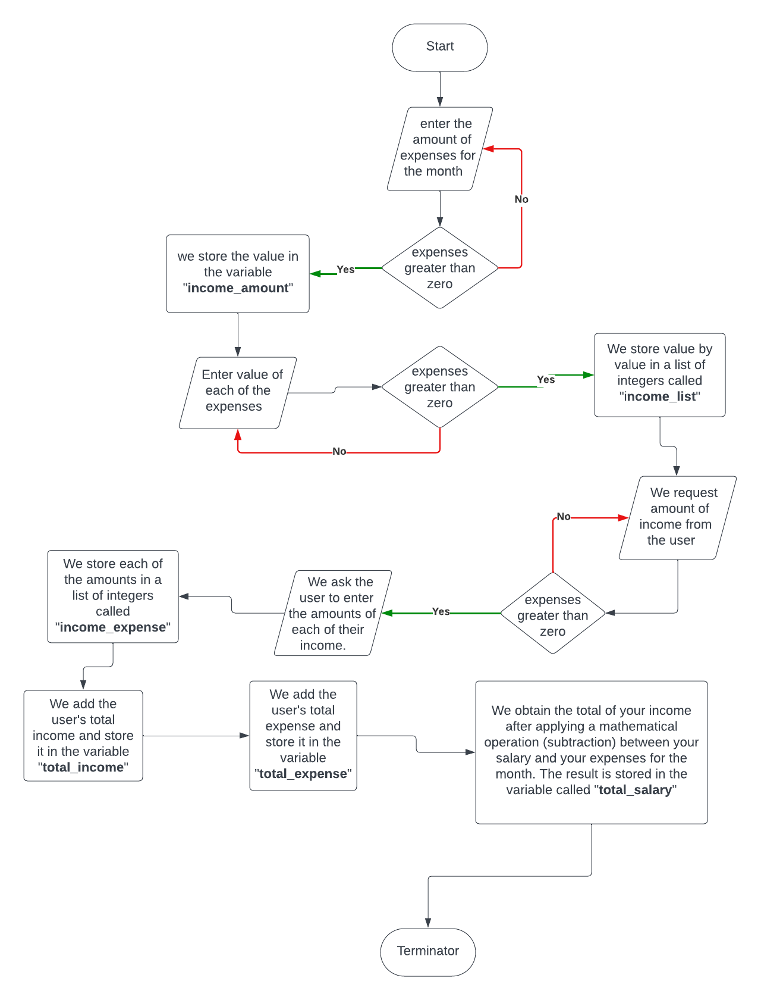

# Expense calculator app
This is a simple expense calculator console app written in Python. The app is designed to calculate the total amount of expenses for a given period of time. The app is designed to be used in the terminal. 

## How to use
1. Clone the repository
2. Open the terminal and navigate to the project folder
3. Run the command `python3 main.py`
4. Follow the instructions in the terminal
5. Enjoy! 😁

## Features
- Add expenses
- View expenses

## Flowchart

## Technologies used
- Python
- Git
- GitHub
- PyCharm
- Terminal
